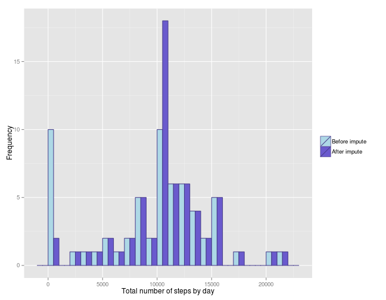
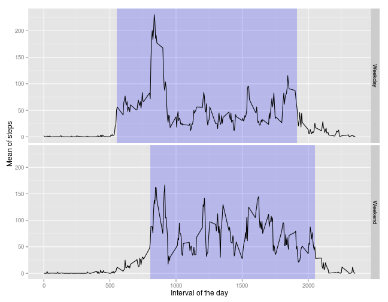

# Reproducible Research: Peer Assessment 1

Before starting, let's load the libraries:

```r
library(ggplot2)
library(plyr)
```

## Loading and preprocessing the data

Load the data from the zip file:

```r
unzip("activity.zip")
data <- read.csv("activity.csv")
```

Use the date format for the date column:

```r
data$date <- as.Date(data$date, format="%Y-%m-%d")
str(data)
```

```
## 'data.frame':	17568 obs. of  3 variables:
##  $ steps   : int  NA NA NA NA NA NA NA NA NA NA ...
##  $ date    : Date, format: "2012-10-01" "2012-10-01" ...
##  $ interval: int  0 5 10 15 20 25 30 35 40 45 ...
```

```r
head(data)
```

```
##   steps       date interval
## 1    NA 2012-10-01        0
## 2    NA 2012-10-01        5
## 3    NA 2012-10-01       10
## 4    NA 2012-10-01       15
## 5    NA 2012-10-01       20
## 6    NA 2012-10-01       25
```

Here is some stats on the dataset:

```r
sum(is.na(data$steps))/length(data$steps)
```

```
## [1] 0.1311
```

So we can see there are some NA values, which will be ignored for the first part of this study.

## What is mean total number of steps taken per day?

First, we calculate the sum of the steps for each day with `ddply`:

```r
aggregationsByDay <- ddply(data, .(date), summarize, sum = sum(steps, na.rm=TRUE))
```

Next we plot the histogram of the total number of steps by day, there we can have an idea of the distribution:

```r
ggplot(aggregationsByDay, aes(x=sum)) +
    geom_histogram(fill = "lightblue", color="darkslateblue", binwidth = 1000) +
    xlab("Total number of steps by day") +
    ylab("Frequency")
```

 

And then the median and the mean for the whole dataset:

```r
meanData <- mean(aggregationsByDay$sum, na.rm=TRUE)
medianData <- median(aggregationsByDay$sum, na.rm=TRUE)
```

The mean of steps is 9354.2295, and the median is 10395.

## What is the average daily activity pattern?

We start by calculating some agregation and we compute the interval with max number of steps:

```r
meanByInterval <- ddply(data, .(interval), summarize, mean=mean(steps, na.rm=TRUE))
intervalWithMaxSteps <- meanByInterval$interval[which.max(meanByInterval$mean)]
```

Let's plot it together, the interval with the greatests number of steps is indicated 
by the blue vertical line:

```r
ggplot(meanByInterval, aes(x=interval, y=mean, group=1)) +
    geom_line() +
    geom_vline(xintercept=intervalWithMaxSteps, col="Blue", size=1.5, alpha=0.5) +
    xlab("Interval of the day") + 
    ylab("Mean of steps")
```

 

So we can see that there are two main patterns in this graph:

* The first one starting from the interval around 500 and ending around 2000,
where we can see an activity in steps
* The second one before 500 and after 2000, where there is fewer activities.

It seems to correspond to the daytime/nightime cycle, so it seems the dataset is meaningful.

## Imputing missing values

Let's calculate the number of missing values:

```r
naCount <- sum(is.na(data$steps))
```

There are 2304 missing values for the steps variable.

We will impute the missing value by using the mean of the interval, as it seems to be a pattern depending on the time in the day.
First we join the initial dataset with the means by interval computed above:

```r
dataJoinWithMeans <- join(data, meanByInterval, by="interval")
head(dataJoinWithMeans)
```

```
##   steps       date interval    mean
## 1    NA 2012-10-01        0 1.71698
## 2    NA 2012-10-01        5 0.33962
## 3    NA 2012-10-01       10 0.13208
## 4    NA 2012-10-01       15 0.15094
## 5    NA 2012-10-01       20 0.07547
## 6    NA 2012-10-01       25 2.09434
```

Then we replace NA steps values with the mean of the corresponding interval:

```r
naValuesPosition <- is.na(dataJoinWithMeans$steps)
dataJoinWithMeans$steps[naValuesPosition] <- dataJoinWithMeans$mean[naValuesPosition]

# Rename the dataframe:
dataAfterImpute <- dataJoinWithMeans
head(dataAfterImpute)
```

```
##     steps       date interval    mean
## 1 1.71698 2012-10-01        0 1.71698
## 2 0.33962 2012-10-01        5 0.33962
## 3 0.13208 2012-10-01       10 0.13208
## 4 0.15094 2012-10-01       15 0.15094
## 5 0.07547 2012-10-01       20 0.07547
## 6 2.09434 2012-10-01       25 2.09434
```

Finally we check the number of NA values:

```r
naCount <- sum(is.na(dataAfterImpute$steps))
```

Now, there is 0 missing values.

Next we'll see if imputing values had impact comparing to the previous histogram:

```r
aggregationsByDayAfterImpute <- ddply(dataAfterImpute, .(date), summarize, sum = sum(steps, na.rm=FALSE))
aggregationsByDayAfterImpute$group <- rep("After impute", nrow(aggregationsByDayAfterImpute))
aggregationsByDay$group <- rep("Before impute", nrow(aggregationsByDay))

# Create a long dataset, thus we can plot a comparison of both histograms
longDF <- rbind(aggregationsByDay, aggregationsByDayAfterImpute)
longDF$group <- factor(longDF$group, levels=c("Before impute", "After impute"))

ggplot(longDF, aes(sum, fill=group)) +
    geom_histogram(color="darkslateblue", binwidth = 1000, position = "dodge", width = 1) +
    xlab("Total number of steps by day") +
    ylab("Frequency") +
    scale_fill_manual(name = "", values = c("lightblue", "slateblue"))
```

 

So we can see that the imputed values seems to follow a more classic standard distribution (with less values with 0 steps by day).

And then the median and the mean for the whole dataset:

```r
meanDataImpute <- mean(aggregationsByDayAfterImpute$sum, na.rm=FALSE)
medianDataImpute <- median(aggregationsByDayAfterImpute$sum, na.rm=FALSE)
```

The mean is 1.0766 &times; 10<sup>4</sup> (was 9354.2295), and median is 1.0766 &times; 10<sup>4</sup> (was 10395).

## Are there differences in activity patterns between weekdays and weekends?

Let's first create a function that will tell us if a day is a weekday or a weekend:

```r
Sys.setlocale("LC_TIME", "C")
```

```
## [1] "C"
```

```r
weekdayOrWeekend <- function (x) {
    if(weekdays(x) %in% c("Saturday", "Sunday")) {
        "Weekend"
    } else {
        "Weekday"
    }
}
```

Next we add a new column "weekday", that will contain the factor "Weekend" or "Weekday":

```r
dataAfterImpute$weekday <- as.factor(sapply(dataAfterImpute$date, weekdayOrWeekend))
head(dataAfterImpute)
```

```
##     steps       date interval    mean weekday
## 1 1.71698 2012-10-01        0 1.71698 Weekday
## 2 0.33962 2012-10-01        5 0.33962 Weekday
## 3 0.13208 2012-10-01       10 0.13208 Weekday
## 4 0.15094 2012-10-01       15 0.15094 Weekday
## 5 0.07547 2012-10-01       20 0.07547 Weekday
## 6 2.09434 2012-10-01       25 2.09434 Weekday
```

Let's compute the mean by weekday then by interval:

```r
dataMeanByWeekdayFactor <- ddply(dataAfterImpute, .(weekday, interval), summarize, mean = mean(steps, na.rm=FALSE))
```

Then the plot, we will also plot a zone of interest where the mean number of steps is greater that 50:

```r
# Highlight zone of interest, ie interval where the mean is greater than 50
intervalWithHigherMeanSteps <- dataMeanByWeekdayFactor$mean >= 50
moreThan50StepsInterval <- ddply(dataMeanByWeekdayFactor[intervalWithHigherMeanSteps,],
    .(weekday),
    summarize,
    xmin = min(interval),
    xmax = max(interval),
    ymin = -Inf,
    ymax = Inf)

ggplot(dataMeanByWeekdayFactor, aes(x=interval,y=mean)) +
    facet_grid(weekday ~ .) +
    geom_rect(data=moreThan50StepsInterval,
              aes(xmin=xmin, xmax=xmax, ymin=ymin, ymax=ymax),
              fill="blue", inherit.aes=FALSE, alpha=0.2) +
    geom_line() +
    xlab("Interval of the day") + 
    ylab("Mean of steps")
```

 

So here we can see that the period of activity varies between weekday and weekend. It seems to be logical
as people tend to wake up earlier in the weekday to go to work.
