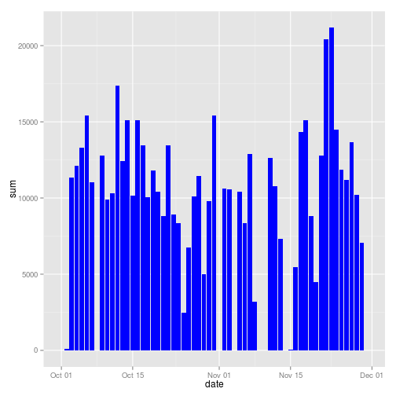
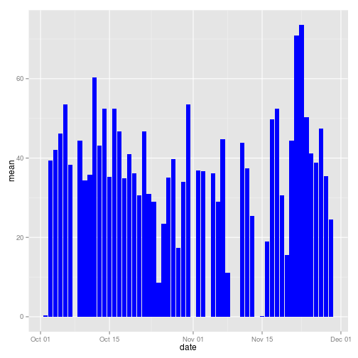

# Reproducible Research: Peer Assessment 1


## Loading and preprocessing the data

Load the data from the zip file:

```r
unzip("activity.zip")
data <- read.csv("activity.csv")
```

Use the date format for the date column:

```r
data$date <- as.Date(data$date, format="%Y-%m-%d")
str(data)
```

```
## 'data.frame':	17568 obs. of  3 variables:
##  $ steps   : int  NA NA NA NA NA NA NA NA NA NA ...
##  $ date    : Date, format: "2012-10-01" "2012-10-01" ...
##  $ interval: int  0 5 10 15 20 25 30 35 40 45 ...
```

```r
head(data)
```

```
##   steps       date interval
## 1    NA 2012-10-01        0
## 2    NA 2012-10-01        5
## 3    NA 2012-10-01       10
## 4    NA 2012-10-01       15
## 5    NA 2012-10-01       20
## 6    NA 2012-10-01       25
```

Here is some stats on the dataset:

```r
sum(is.na(data$steps))/length(data$steps)
```

```
## [1] 0.1311
```

## What is mean total number of steps taken per day?

Let's plot the total number of steps by day:

```r
library(ggplot2)
library(plyr)
meanByDay <- ddply(data, .(date), summarize, sum = sum(steps, na.rm=TRUE), mean = mean(steps, na.rm=TRUE), median = median(steps, na.rm=TRUE))
ggplot(data=meanByDay, aes(x=date)) + geom_histogram(aes(y=sum), stat="identity", fill = "blue")
```

 

```r
ggplot(data=meanByDay, aes(x=date)) + geom_histogram(aes(y=mean), stat="identity", fill = "blue")
```

```
## Warning: Removed 8 rows containing missing values (position_stack).
```

 

```r
ggplot(data=meanByDay, aes(x=date)) + geom_histogram(aes(y=median), stat="identity", fill = "blue")
```

```
## Warning: Removed 8 rows containing missing values (position_stack).
```

 

And then the median and the mean for the whole dataset:

```r
meanData <- mean(data$steps, na.rm=TRUE)
medianData <- median(data$steps, na.rm=TRUE)
```

The mean of steps is 37.3826, and the median is 0.

## What is the average daily activity pattern?


```r
sumByInterval <- ddply(data, .(interval), summarize, mean=mean(steps, na.rm=TRUE))
intervalWithMaxSteps <- sumByInterval$interval[which.max(sumByInterval$mean)]

ggplot(sumByInterval, aes(x=interval, y=mean, group=1)) + geom_line() + geom_vline(xintercept=intervalWithMaxSteps, col="Blue", size=1.5, alpha=0.5)
```

 


## Imputing missing values

Let's calculate the missing values:

```r
naCount <- sum(is.na(data$steps))
```

There are 2304 missing values for the steps variable.

We will impute the missing value by using the mean of the interval, as it seems to be pattern depending on the time in the day.


```r
dataJoinWithMeans <- join(data, sumByInterval, by="interval")
dataJoinWithMeans$steps[is.na(dataJoinWithMeans$steps)] <- dataJoinWithMeans$mean[is.na(dataJoinWithMeans$steps)]

naCount <- sum(is.na(dataJoinWithMeans$steps))
```

Now, there is 0 missing values.

Next we'll see if imputing values had impact comparing to the previous histogram:

```r
imputedMeanByDay <- ddply(dataJoinWithMeans, .(date), summarize, sum = sum(steps, na.rm=FALSE), mean = mean(steps, na.rm=FALSE), median = median(steps, na.rm=FALSE))
joinDF <- merge(meanByDay, imputedMeanByDay, by="date")
# colnames(joinDF)
# imputedMeanByDay$fill <- rep("red", nrow(imputedMeanByDay))
# longDF <- rbind(meanByDay, imputedMeanByDay)
ggplot(data=imputedMeanByDay, aes(x=date)) + geom_histogram(aes(y=sum), stat="identity", fill="blue")
```

 

And then the median and the mean for the whole dataset:

```r
meanDataImpute <- mean(dataJoinWithMeans$steps, na.rm=TRUE)
medianDataImpute <- median(dataJoinWithMeans$steps, na.rm=TRUE)
```

The mean is 37.3826 (was 37.3826), and median is 0 (was 0).

## Are there differences in activity patterns between weekdays and weekends?
