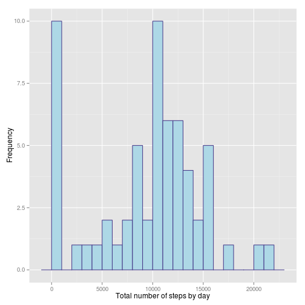

# Reproducible Research: Peer Assessment 1


## Loading and preprocessing the data

Load the data from the zip file:

```r
unzip("activity.zip")
data <- read.csv("activity.csv")
```

Use the date format for the date column:

```r
data$date <- as.Date(data$date, format="%Y-%m-%d")
str(data)
```

```
## 'data.frame':	17568 obs. of  3 variables:
##  $ steps   : int  NA NA NA NA NA NA NA NA NA NA ...
##  $ date    : Date, format: "2012-10-01" "2012-10-01" ...
##  $ interval: int  0 5 10 15 20 25 30 35 40 45 ...
```

```r
head(data)
```

```
##   steps       date interval
## 1    NA 2012-10-01        0
## 2    NA 2012-10-01        5
## 3    NA 2012-10-01       10
## 4    NA 2012-10-01       15
## 5    NA 2012-10-01       20
## 6    NA 2012-10-01       25
```

Here is some stats on the dataset:

```r
sum(is.na(data$steps))/length(data$steps)
```

```
## [1] 0.1311
```

## What is mean total number of steps taken per day?

First, we calculate the sum of the steps for each day with `ddply`:

```r
library(plyr)
aggregationsByDay <- ddply(data, .(date), summarize, sum = sum(steps, na.rm=TRUE), mean = mean(steps, na.rm=TRUE), median = median(steps, na.rm=TRUE))
```

Next we plot the histogram of the total number of steps by day, there we can have an idea of the distribution:

```r
library(ggplot2)
ggplot(aggregationsByDay, aes(x=sum)) + geom_histogram(fill = "lightblue", color="darkslateblue", binwidth = 1000)
```

 

Below is the histogram of the mean number of steps by day:

```r
ggplot(aggregationsByDay, aes(x=mean)) + geom_histogram(fill = "slateblue", color="darkslateblue", binwidth = 5)
```

 

We don't plot the median as it is always zero, below is the result of the quantile function:

```r
quantile(data$steps, na.rm=TRUE)
```

```
##   0%  25%  50%  75% 100% 
##    0    0    0   12  806
```

And then the median and the mean for the whole dataset:

```r
meanData <- mean(aggregationsByDay$sum, na.rm=TRUE)
medianData <- median(aggregationsByDay$sum, na.rm=TRUE)
```

The mean of steps is 9354.2295, and the median is 10395.

## What is the average daily activity pattern?

We start by calculating some agregation and we compute the interval with max number of steps:

```r
sumByInterval <- ddply(data, .(interval), summarize, mean=mean(steps, na.rm=TRUE))
intervalWithMaxSteps <- sumByInterval$interval[which.max(sumByInterval$mean)]
```

Let's plot it together, the interval with the greatests number of steps is indicated 
by the blue vertical line:

```r
ggplot(sumByInterval, aes(x=interval, y=mean, group=1)) + geom_line() + geom_vline(xintercept=intervalWithMaxSteps, col="Blue", size=1.5, alpha=0.5)
```

 

## Imputing missing values

Let's calculate the number of missing values:

```r
naCount <- sum(is.na(data$steps))
```

There are 2304 missing values for the steps variable.

We will impute the missing value by using the mean of the interval, as it seems to be pattern depending on the time in the day.


```r
dataJoinWithMeans <- join(data, sumByInterval, by="interval")
dataJoinWithMeans$steps[is.na(dataJoinWithMeans$steps)] <- dataJoinWithMeans$mean[is.na(dataJoinWithMeans$steps)]

naCount <- sum(is.na(dataJoinWithMeans$steps))
```

Now, there is 0 missing values.

Next we'll see if imputing values had impact comparing to the previous histogram:

```r
imputedMeanByDay <- ddply(dataJoinWithMeans, .(date), summarize, sum = sum(steps, na.rm=FALSE), mean = mean(steps, na.rm=FALSE), median = median(steps, na.rm=FALSE))
joinDF <- merge(dataJoinWithMeans, imputedMeanByDay, by="date")
# colnames(joinDF)
# imputedMeanByDay$fill <- rep("red", nrow(imputedMeanByDay))
# longDF <- rbind(meanByDay, imputedMeanByDay)
ggplot(data=imputedMeanByDay, aes(x=date)) + geom_histogram(aes(y=sum), stat="identity", fill="blue")
```

 

And then the median and the mean for the whole dataset:

```r
meanDataImpute <- mean(imputedMeanByDay$sum, na.rm=TRUE)
medianDataImpute <- median(imputedMeanByDay$sum, na.rm=TRUE)
```

The mean is 1.0766 &times; 10<sup>4</sup> (was 9354.2295), and median is 1.0766 &times; 10<sup>4</sup> (was 10395).

## Are there differences in activity patterns between weekdays and weekends?


```r
weekdayOrWeekend <- function (x) {
    if(weekdays(x) %in% c("Saturday", "Sunday")) {
        "Weekend"
    } else {
        "Weekday"
    }
}
dataJoinWithMeans$weekday <- as.factor(sapply(dataJoinWithMeans$date, weekdayOrWeekend))

dataMeanByWeekdayFactor <- ddply(dataJoinWithMeans, .(weekday, interval), summarize, mean = mean(steps, na.rm=FALSE))

# Highlight zone of interest, ie interval where the mean is greater than 50
moreThan50StepsInterval <- ddply(dataMeanByWeekdayFactor[dataMeanByWeekdayFactor$mean >= 50,], .(weekday), summarize, xmin = min(interval), xmax = max(interval), ymin = -Inf, ymax = Inf)

ggplot(dataMeanByWeekdayFactor, aes(x=interval,y=mean)) +
    facet_grid(weekday ~ .) +
    geom_rect(data=moreThan50StepsInterval,
              aes(xmin=xmin, xmax=xmax, ymin=ymin, ymax=ymax),
              fill="blue", inherit.aes=FALSE, alpha=0.2) +
    geom_line()
```

 
